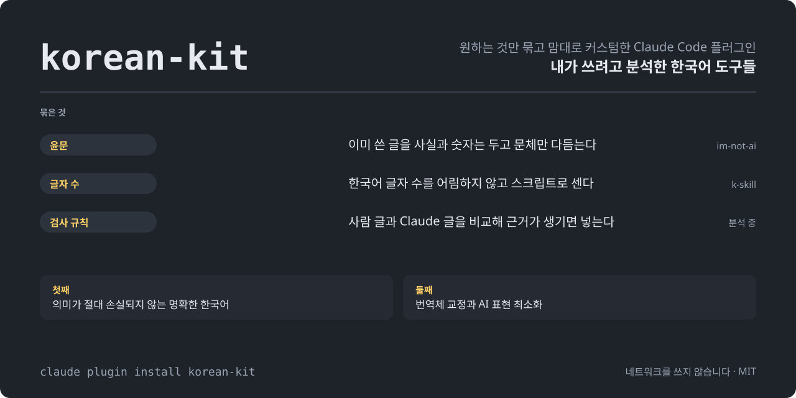

<p align="center">

<a href="https://github.com/IsthisLee/korean-kit/actions/workflows/validate.yml"></a>
<a href="https://github.com/IsthisLee/korean-kit/actions/workflows/codeql.yml"></a>


<a href="https://github.com/IsthisLee/korean-ai-signals"></a>

</p>

<picture>

  <source media="(prefers-color-scheme: dark)" srcset="docs/assets/hero.svg">

  <source media="(prefers-color-scheme: light)" srcset="docs/assets/hero-light.svg">

  

</picture>

<p align="center">

<strong>내가 쓰려고 다양한 한국어 도구들 분석하고, 원하는 것만 묶고 맘대로 커스텀한 Claude Code 플러그인</strong><br>  
무엇을 묶을지는 사람이 쓴 글과 Claude가 쓴 글을 직접 비교한 결과로 정했습니다.

</p>

<p align="center">
<a href="#이-플러그인은">소개</a> ·
<a href="#묶은-것">묶은 것</a> ·
<a href="#어떻게-골랐나">고른 기준</a> ·
<a href="#분석-결과">분석 결과</a> ·
<a href="#분석-도구">분석 도구</a> ·
<a href="#설치">설치</a> ·
<a href="#사용법">사용법</a> ·
<a href="#원칙">원칙</a> ·
<a href="#기여">기여</a>
</p>

> [!NOTE]
> 표본은 학습에 사용하지 않습니다.
>
> 한국어 검사 도구를 검증하는 용도로만 사용합니다.

> [!IMPORTANT]
> 이 README는 [분석 계획](https://github.com/IsthisLee/korean-ai-signals/blob/main/docs/plan.md)을 모두 마친 상태를 기준으로 썼습니다. 사람 글 487편은 모았고 본 측정은 아직 돌리지 않아서, 「측정 전」이라고 적힌 칸에는 결과가 없습니다.

## 이 플러그인은

Claude Code로 한국어 문서를 쓰면서 번역투와 AI 티를 줄여 준다는 도구를 여럿 써 봤습니다. 써 보니 두 가지가 걸렸습니다. 도구마다 AI 티라고 부르는 목록의 근거가 약했고, 도구가 알려 준 대로 고치다가 원래 있던 내용이 사라진 적도 있었습니다.

그래서 도구를 고르기 전에 사람이 쓴 글과 Claude가 쓴 글을 직접 비교했습니다. 두 글을 실제로 가르는 신호로 검사기를 만들고, 그 검사기로 문체 도구와 윤문 도구를 같은 조건에서 견줬습니다. 비교로 고를 수 있는 도구는 기준을 통과한 것만 묶었고, 묶은 도구도 제 작업 방식에 맞게 고쳤습니다. 모두에게 맞추려는 범용 도구가 아니라 제가 쓰려고 만든 묶음입니다. 비교에 쓴 장비와 계획, 결과는 별도 저장소 [korean-ai-signals](https://github.com/IsthisLee/korean-ai-signals) 에 모두 공개돼 있습니다.

도구를 고르는 기준은 두 가지이고, 첫째가 둘째보다 앞섭니다.

1. **의미가 절대 손실되지 않는 명확한 한국어**
2. **번역체 교정과 AI 표현 최소화**

뜻을 하나라도 잃은 도구는 AI 티가 아무리 적어도 묶지 않습니다.

## 묶은 것

| 기능        | 하는 일                                                                                           | 어떻게 골랐나                                                                                                                                                                                                | 가져온 곳                                                                           |
| ----------- | ------------------------------------------------------------------------------------------------- | ------------------------------------------------------------------------------------------------------------------------------------------------------------------------------------------------------------ | ----------------------------------------------------------------------------------- |
| **윤문**    | 이미 쓴 글을 사실과 숫자는 그대로 두고 문체만 다듬습니다                                          | 후보 9개를 같은 원문에 돌려, 뜻 손실이 0건인 도구 가운데 AI 신호가 가장 적은 것을 묶습니다                                                                                                                   | 측정 전. 지금은 [im-not-ai](https://github.com/epoko77-ai/im-not-ai) 커밋 `9747f03` |
| **글자 수** | 한국어 글자 수를 모델이 어림잡지 않고 스크립트로 셉니다                                           | 세기만 하는 도구라서 비교하지 않았습니다                                                                                                                                                                     | [k-skill](https://github.com/NomaDamas/k-skill)                                     |

플러그인에 넣지 않고 따로 쓰는 것이 둘 있습니다.

| 무엇                    | 하는 일                                                                       | 어떻게 골랐나                                                                                               | 어디에                                                                                                            |
| ----------------------- | ----------------------------------------------------------------------------- | ----------------------------------------------------------------------------------------------------------- | ----------------------------------------------------------------------------------------------------------------- |
| **권하는 output style** | 평소 답변과 처음 쓰는 글의 문체를 정합니다                                    | 한국어 output style 을 같은 요청에 켜고 비교해, 뜻 손실이 0건인 것 가운데 AI 신호가 가장 적은 것을 권합니다 | 측정 전                                                                                                           |
| **AI 신호 검사기**      | 글 한 편의 AI 신호 점수를 내고 문턱을 넘으면 알립니다. 고치게 하지는 않습니다 | 사람 글 600편과 Claude 글 1,200편으로 만들고, 검증용 사람 글 300편에서 한 편도 잡지 않는지 확인합니다       | 저장소의 [`docs/experiments/ai-writing-signals/`](docs/experiments/ai-writing-signals/). 설치본에는 넣지 않습니다 |


### 묶으며 고친 것

| 도구            | 고친 것                                                                                                                                          |
| --------------- | ------------------------------------------------------------------------------------------------------------------------------------------------ |
| im-not-ai 윤문  | 런타임에 쓰는 스킬 셋, 에이전트 셋, 스크립트 아홉만 가져왔고, `humanize-korean` 설명의 트리거 문구 "AI detector bypass 한글" 하나만 뺐습니다     |
| k-skill 글자 수 | 스크립트는 그대로 두고 실행 경로를 고쳤으며, 스킬 설명은 원본을 바탕으로 다시 썼습니다                                                           |

비교 결과로 윤문 도구를 바꾸면 이 표와 [plugin/NOTICE.md](plugin/NOTICE.md)를 함께 고칩니다.

### 뺀 것

써 보고 뺀 기능입니다. 경위는 [CHANGELOG.md](CHANGELOG.md)에 있습니다.

| 뺀 것                                       | 이유                                                                                                                      |
| ------------------------------------------- | ------------------------------------------------------------------------------------------------------------------------- |
| 평소 답변과 서브에이전트에 문체 규칙 주입   | 규칙을 넣으면 답에서 기본값 같은 세부가 빠졌습니다. 같은 길이의 중립 문장을 넣었을 때는 빠지지 않았습니다(H13절)          |
| 이 플러그인이 쓰던 작성 스킬과 output style | 평소 답변과 처음 쓰는 글의 문체는 사용자가 고른 output style 에 맡겼습니다. 어떤 것을 권할지는 비교 결과로 정합니다(J3절) |

## 어떻게 골랐나

### 왜 직접 비교했나

1. **널리 퍼진 AI 티 목록은 근거가 약합니다.** 한국어 AI 글을 사람 글과 직접 비교한 연구를 찾아보니 두 편뿐이었고, 그중 지표를 공개한 KatFishNet(ACL 2025)이 검증한 것이 8개였습니다. 흔히 말하는 줄표·복수형 `-들`·「A가 아니라 B」 대구는 그런 연구를 찾지 못했습니다.
2. **사람 글을 AI 글로 잘못 잡으면 해롭습니다.** 영어 AI 탐지기가 비원어민이 쓴 글을 AI 글로 잘못 분류했다는 연구가 있습니다([Liang 외 2023](https://arxiv.org/abs/2304.02819)).
3. **규칙대로 고치다가 뜻을 잃은 적이 있습니다.** 예전에 쓰던 검사 규칙의 안내대로 고친 대조 글에서 정보가 사라지거나 문장을 잇는 말이 빠졌습니다.
4. **예전 측정은 근거가 되지 못했습니다.** 사람 글을 파일 수정 연도로 짐작했고, 합격선을 결과를 본 뒤에 적었습니다.

### 비교 순서

| 단계                   | 하는 일                                                                                                                                                                                                                                               |
| ---------------------- | ----------------------------------------------------------------------------------------------------------------------------------------------------------------------------------------------------------------------------------------------------- |
| 1. 기준 공개           | 표본, 판정 기준, 비교 순서를 결과보다 먼저 [분석 계획](https://github.com/IsthisLee/korean-ai-signals/blob/main/docs/plan.md)에 적고 커밋합니다                                                                                                                                  |
| 2. 파일럿              | 사람 글 30편과 Claude 글 30편으로 수집부터 판정까지 두 번 돌려 방법을 고칩니다                                                                                                                                                                        |
| 3. 사람 글 수집        | ChatGPT가 공개된 2022-11-30 이전의 글 487편을 모읍니다. 위키백과 옛 판 300편, 기업 기술 블로그 129편(회사마다 15편까지), 개인 블로그 58편입니다. 블로그 글은 Common Crawl이 그날 전에 수집한 본문만 쓰고, 번역 위주 블로그는 뺍니다                  |
| 4. Claude 글 생성      | 사람 글 한 편마다 같은 제목과 장르로 한 편씩, 모두 487편을 씁니다. 장르 안에서 claude-opus-5 와 claude-sonnet-5 를 번갈아 쓰고, 제목 100개에는 분량을 지정하지 않은 두 번째 프롬프트로도 한 편씩 더 만듭니다. output style, 사용자 설정, 도구 없이 씁니다                                                                                                        |
| 5. 신호 계산           | 짝마다 긴 쪽 글을 짧은 쪽 길이에 맞춰 문장 경계에서 자른 뒤, 형태소 분석기 Kiwi로 KatFishNet 이 한국어에서 검증한 지표 8개를 잽니다                                                                                                                                 |
| 6. 검사기 만들기       | 훈련 자료(사람 글 243편과 짝이 되는 Claude 글)에서 성격이 같은 지표 묶음마다 가장 잘 가르는 지표를 고르고, 그 로그 우도비를 더해 문서 점수를 만듭니다                                                                                             |
| 7. 문턱 확인           | 훈련·개발 자료의 사람 글이 한 편도 넘지 않도록 문턱을 정하고, 끝까지 손대지 않은 시험 자료 122편에 한 번만 적용해 오탐을 잽니다. 122편에서 0건이면 사람 글을 잘못 잡는 비율이 2.5%를 넘지 않는다고 95% 확신할 수 있습니다. 개인 블로그에만 오판이 몰리지 않는지 장르별로도 봅니다                                            |
| 8. 검사 규칙 만들기 | 통하는 지표 가운데 정규식으로 옮길 수 있는 것을 골라 규칙으로 만듭니다. 사람 글을 한 편도 잡지 않고 Claude 글을 잡은 규칙만 남깁니다 |
| 9. 도구 비교           | output style 후보와 윤문 도구 후보에 같은 요청과 같은 원문을 넣고 아래 기준으로 잽니다                                                                                                                                                                |
| 10. 결정과 기록        | 무엇을 묶고 권했는지와 그 이유를 분석 계획에 적고 이 README에 반영합니다                                                                                                                                                                              |

### 도구 비교 기준

1. **뜻 손실이 0건인 도구만 남깁니다.** 원문이나 요청에 담긴 사실을 목록으로 미리 만들고, 결과 글에서 사라지거나 바뀌거나 새로 생긴 사실과 빠진 문장 성분을 셉니다. 1건이라도 있으면 탈락입니다.
2. **남은 도구는 자연스러움으로 줄 세웁니다.** 두 도구의 결과를 나란히 놓고 어느 쪽이 사람이 쓴 글에 가까운지 블라인드로 고르게 합니다. 쌍마다 순서를 바꿔 두 번 묻고 승패를 이항 검정으로 셉니다.
3. **자연스러움이 갈리지 않으면 AI 신호 밀도로 가립니다.** 검사기 점수를 1,000자당으로 세고, 사람 글의 값을 기준선으로 함께 적습니다.
4. **그래도 같으면 명확성으로 가립니다.** 주어나 지시 대상이 모호한 곳을 셉니다.

자연스러움을 AI 신호 밀도보다 앞에 둔 이유가 있습니다. 표지를 적게 만드는 것과 잘 읽히게 만드는 것은 다릅니다. 이 저장소에서 규칙을 늘려 표지를 크게 줄인 판이 블라인드 쌍대 판정에서 옛 판을 이기지 못한 적이 있습니다(5승 6패).

뜻 손실은 claude-opus-5 가 순서를 바꿔 두 번 판정하고, 판정의 일부는 사람이 원문과 대조합니다. 원문을 얼마나 바꿨는지(변경률)도 기록해서 과하게 고친 경우를 가려냅니다. 판정 기준 전문은 [분석 계획 8절](https://github.com/IsthisLee/korean-ai-signals/blob/main/docs/plan.md#8-도구-비교)에 있습니다.

## 분석 결과

본 측정을 마치면 채웁니다. 방법과 판정 기준은 [분석 계획](https://github.com/IsthisLee/korean-ai-signals/blob/main/docs/plan.md)에 결과보다 먼저 적어 두었습니다.

### AI 신호 검사기

| 항목                                       | 결과              |
| ------------------------------------------ | ----------------- |
| 시험 자료 사람 글 122편 가운데 문턱을 넘은 글 | 측정 전(기준 0편) |
| 문턱을 넘은 Claude 글                      | 측정 전           |
| AUROC 전체                                 | 측정 전           |
| AUROC 위키백과 / 기술 블로그 / 개인 블로그 | 측정 전           |
| AUROC claude-opus-5 / claude-sonnet-5      | 측정 전           |
| 채택한 신호와 심각도                       | 측정 전           |

AUROC는 사람 글과 Claude 글을 한 편씩 짝지었을 때 Claude 글의 점수가 더 높은 비율입니다. 0.5이면 두 글을 가르지 못하는 것이고, 1이면 완전히 가르는 것입니다.

### output style

| output style                                             | 라이선스 | 뜻 손실 | 자연스러움 | AI 신호 밀도(1,000자당) | 명확성  | 판정      |
| -------------------------------------------------------- | -------- | ------- | ---------- | ----------------------- | ------- | --------- |
| 기준선(아무것도 켜지 않음)                               | —        | 측정 전 | 측정 전    | 측정 전                 | 측정 전 | 비교 기준 |
| [fluent-korean](https://github.com/snflkd/fluent-korean) | MIT      | 측정 전 | 측정 전    | 측정 전                 | 측정 전 | 측정 전   |

output style 로 배포되는 한국어 플러그인은 2026-09-15 까지 이것 하나를 찾았습니다. 찾은 방법은 [분석 계획](https://github.com/IsthisLee/korean-ai-signals/blob/main/docs/plan.md)에 있습니다.

### 윤문 도구

| 도구                                                                                  | 라이선스   | 뜻 손실 | 자연스러움 | AI 신호 밀도(1,000자당) | 명확성  | 변경률  | 판정    |
| ------------------------------------------------------------------------------------- | ---------- | ------- | ---------- | ----------------------- | ------- | ------- | ------- |
| [k-skill](https://github.com/NomaDamas/k-skill) `korean-humanizer`                    | MIT        | 측정 전 | 측정 전    | 측정 전                 | 측정 전 | 측정 전 | 측정 전 |
| [im-not-ai](https://github.com/epoko77-ai/im-not-ai) `humanize-korean` (지금 묶은 것) | MIT        | 측정 전 | 측정 전    | 측정 전                 | 측정 전 | 측정 전 | 측정 전 |
| [claude-forge](https://github.com/sangrokjung/claude-forge) `humanize-korean`         | MIT        | 측정 전 | 측정 전    | 측정 전                 | 측정 전 | 측정 전 | 측정 전 |
| [patina](https://github.com/devswha/patina)                                           | MIT        | 측정 전 | 측정 전    | 측정 전                 | 측정 전 | 측정 전 | 측정 전 |
| [DaleSeo/korean-skills](https://github.com/DaleSeo/korean-skills) `humanizer`         | MIT        | 측정 전 | 측정 전    | 측정 전                 | 측정 전 | 측정 전 | 측정 전 |
| [korean-report-skills](https://github.com/JangHyun-bin/korean-report-skills)          | Apache-2.0 | 측정 전 | 측정 전    | 측정 전                 | 측정 전 | 측정 전 | 측정 전 |
| [korean-prose-skill](https://github.com/JellyBrick/korean-prose-skill)                | **없음**   | 측정 전 | 측정 전    | 측정 전                 | 측정 전 | 측정 전 | 측정 전 |
| [yoonmoon](https://github.com/amondnet/yoonmoon)                                      | MIT        | 측정 전 | 측정 전    | 측정 전                 | 측정 전 | 측정 전 | 측정 전 |
| [stop-slop-ko](https://github.com/limleesol/stop-slop-ko)                             | MIT        | 측정 전 | 측정 전    | 측정 전                 | 측정 전 | 측정 전 | 측정 전 |

k-skill 의 맞춤법 검사기는 외부 서비스의 이용 조건 때문에 대량 측정에서 뺍니다.

라이선스는 2026-09-18 에 GitHub API 로 확인했습니다. `korean-prose-skill` 은 LICENSE 파일도 README 의 언급도 없어 기본값인 「모든 권리 유보」입니다. 재배포가 막히므로 측정 결과와 무관하게 묶을 수 없고, 비교 대상으로만 둡니다. `korean-report-skills` 는 Apache-2.0 이라 묶게 되면 NOTICE 고지 조건이 더 붙습니다.

## 설치

```bash
claude plugin marketplace add IsthisLee/korean-kit
claude plugin install korean-kit
```

`claude plugin list` 에 `korean-kit` 이 `enabled` 로 보이면 끝입니다. 새 버전은 `claude plugin update korean-kit` 으로 받습니다. 권하는 output style 은 이 플러그인에 들어 있지 않으므로, 위 결과표에 링크한 저장소의 안내대로 따로 설치합니다.

| 필요한 것         | 어디에 쓰나                               | 없으면                   |
| ----------------- | ----------------------------------------- | ------------------------ |
| Claude Code       | 전부. 2.1.267에서 확인                    |                          |
| `python3` 3.10 이상 | 윤문 스크립트                             | 윤문을 쓸 수 없습니다    |
| `node` 18+        | 글자 수 스크립트                          | 그 스킬만 쓸 수 없습니다 |

CI가 macOS와 Linux에서 같은 검사를 돌립니다. Windows는 Git Bash나 WSL이 필요하고 아직 돌려 보지 않았습니다.

## 사용법

평소처럼 말하면 됩니다.

```
아래 글 번역투만 고쳐줘. 사실과 숫자는 그대로 두고.
이 자기소개서 공백 포함 몇 자야? 1,000자 제한이야.
이번 배포 QA 보고서를 배포-QA.md로 써줘.
```

| 무엇이   | 저절로 도는 때                                   | 직접 부르는 명령                               |
| -------- | ------------------------------------------------ | ---------------------------------------------- |
| 윤문     | "AI 티 없애줘", "번역투 고쳐줘" 같은 요청        | `/korean-kit:humanize [글 또는 파일 경로]` |
| 2차 윤문 | 저절로 돌지 않습니다                             | `/korean-kit:humanize-redo [지시]`         |
| 글자 수  | "500자 이내로", "글자 수 세줘" 같은 요청         | `/korean-kit:korean-character-count`       |

## 분석 도구

무엇을 묶을지 정하는 데 쓴 분석 도구는 별도 저장소 [korean-ai-signals](https://github.com/IsthisLee/korean-ai-signals) 에 있습니다. 사람 글과 Claude 글을 모으는 수집기, 지표를 재는 측정기, 결과보다 먼저 적은 [분석 계획](https://github.com/IsthisLee/korean-ai-signals/blob/main/docs/plan.md), 측정 결과가 모두 거기 있습니다. 형태소 분석기 Kiwi와 SciPy가 필요해서 이 플러그인과 따로 두었습니다. 준비 명령과 돌리는 순서는 그 저장소의 README에 있습니다. Claude 글을 새로 만들려면 로그인한 `claude` 명령이 필요하고 호출마다 비용이 듭니다. 모은 사람 글 본문과 Claude 글은 커밋하지 않고, 출처 주소와 게시일을 적은 목록만 커밋합니다.

## 원칙

- **뜻이 먼저입니다.** 뜻을 잃은 도구는 AI 티가 적어도 묶지 않습니다.
- **사람 글을 잡는 것이 놓치는 것보다 나쁩니다.** 검사기의 문턱과 검사 규칙 모두 사람 글 0건을 먼저 봅니다.
- **기준은 결과보다 먼저 공개합니다.** 결과를 본 뒤 기준을 바꾸게 되면 원래 결과를 지우지 않고 사후 변경이라고 표시합니다.
- **3자 서비스와 통신하지 않습니다.** 설치본의 스킬과 스크립트는 네트워크를 쓰지 않고, 확인하는 명령은 [SECURITY.md](SECURITY.md)에 있습니다. 표본 수집과 Claude 글 생성은 저장소의 분석 스크립트만 하며 설치본에는 들어가지 않습니다.
- **가져온 파일은 가져온 대로 둡니다.** 출처와 고친 줄은 [plugin/NOTICE.md](plugin/NOTICE.md)에 있습니다.

**저장할 때 검사하는 훅은 지금 없습니다.** 근거 없이 정한 규칙을 걷어냈고, 비교 분석에서 통하는 지표가 나오면 그것으로 다시 만듭니다.

## 저장소 구성

`plugin/` 만 설치한 사람의 기계로 복사됩니다. 테스트, 분석 스크립트, CI는 그 밖에 둡니다.

```
korean-kit/
├── plugin/        설치본: 매니페스트, 윤문 스킬·에이전트, 글자 수 스킬
├── tools/         가드, 릴리스, 그림 스크립트
└── docs/assets/   그림
```

## 기여

제 작업에 맞춘 묶음이지만 제보는 반깁니다. 절차는 [CONTRIBUTING.md](CONTRIBUTING.md)에 있습니다. 윤문이 뜻을 바꾸거나 스크립트가 죽었다면 [버그 제보](https://github.com/IsthisLee/korean-kit/issues/new?template=bug.yml)로 고치지 않은 원문 그대로 보내 주세요. 받아서 확인하는 명령은 이렇습니다.

```bash
python3 -m py_compile plugin/scripts/*.py
node plugin/skills/korean-character-count/scripts/korean_character_count.js --text "가나다" --format text
```

## 출처와 라이선스

윤문 스킬·에이전트·스크립트는 [im-not-ai](https://github.com/epoko77-ai/im-not-ai) 커밋 `9747f03`, 글자 수 스킬은 [k-skill](https://github.com/NomaDamas/k-skill)에서 가져왔습니다. 가져온 파일의 라이선스는 모두 MIT이고 원 저작권 표시는 [plugin/NOTICE.md](plugin/NOTICE.md)에 있습니다. 이 저장소의 라이선스도 [MIT](LICENSE)입니다.

---

<p align="center"><sub>Built with <a href="https://claude.com/claude-code">Claude Code</a> · <a href="./LICENSE">MIT</a></sub></p>
